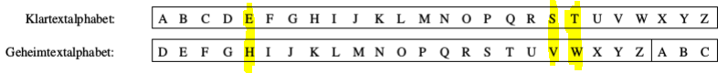

+++
title = "Caesar-Verschlüsselung"
weight = 1
+++

Das Caesar-Verfahren ist ein unsicheres, symmetrisches Verschlüsselungsverfahren. Bei der Verschlüsselung wird das Alphabet um einen festen Schlüssel verschoben, wobei dieser eine Zahl von 1-25 an nehmen kann. Das Verfahren ist unsicher, da es nur 25 verschiedene Schlüssel gibt, wodurch alle möglichen Kombinationen schnell ausprobiert werden können.

Beispiel:

Verschlüsseln wir eine Nachricht:

→ "TEST"

Wir erhalten:  
T → W  
E → H  
S → V  
T → W  

Verschlüsselt: WHVW

Beim Entschlüsseln wird dieser Vorgang einfach rückwärts durchgeführt.